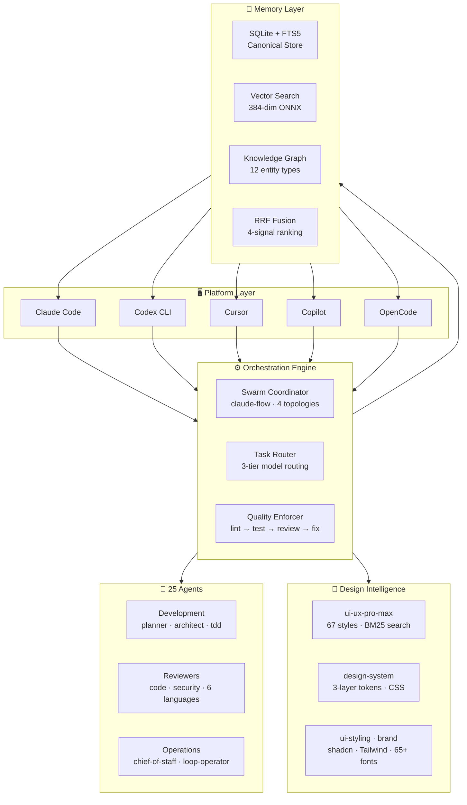
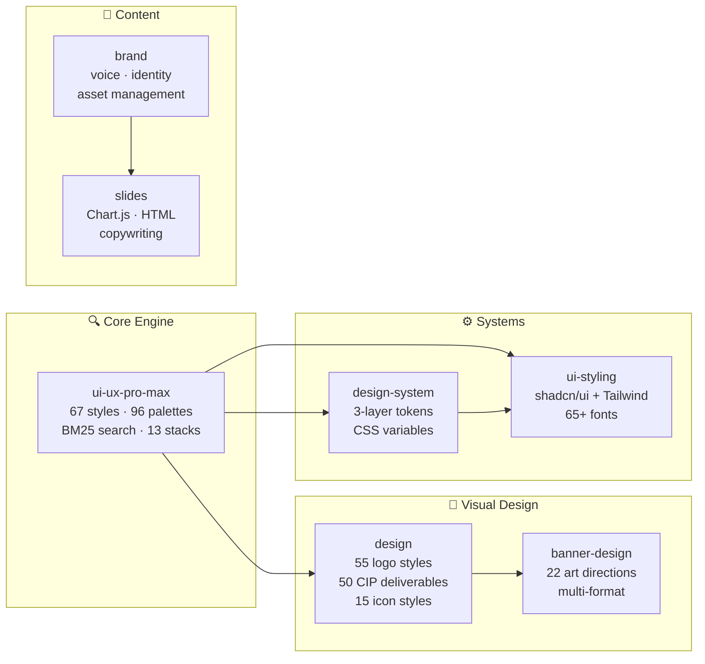

<div align="center">

<br>

# ⚡ CLAUDE FULCRUM

### The Operating System for AI-Powered Development

<br>

**25 Agents** · **119 Skills** · **62 Commands** · **9 Language Rulesets** · **1,536 Tests** · **6 Platforms**

One harness. Every AI coding tool. Unified memory. Swarm orchestration. Neural search. Design intelligence.

<br>

[](LICENSE)
[](#-test-suite)
[](https://nodejs.org)

[](#-supported-platforms)
[](#-supported-platforms)
[](#-supported-platforms)
[](#-supported-platforms)
[](#-supported-platforms)

<br>

[**Quick Start**](#-quick-start) · [**A Day with Fulcrum**](#-what-a-day-with-fulcrum-feels-like) · [**Architecture**](#-system-architecture) · [**Core Systems**](#-core-systems) · [**Design Intelligence**](#7-uiux-design-intelligence) · [**Agents**](#-agent-catalog) · [**Skills**](#-119-workflow-skills) · [**Performance**](#-performance) · [**Roadmap**](#-roadmap)

---

</div>

> **What is this?** Claude Fulcrum is a production-grade agent harness that unifies **Claude Code, Codex CLI, Cursor, GitHub Copilot, and OpenCode** into a single development environment — with shared vector memory, 4-signal neural search, knowledge graphs, swarm orchestration, 33 lifecycle hooks, 25 specialized AI agents, and a **full UI/UX design intelligence suite** that activate automatically based on what you're doing.

<br>

## Why Fulcrum?

**Claude Code knows what you did in Claude Code.**
**Cursor knows what you did in Cursor.**
**Copilot knows nothing.**

None of them share memory. None of them learn from each other. Every session, every tool, starts from zero.

Fulcrum fixes this with one shared memory layer — FTS5 + vector embeddings + knowledge graph — that all 6 platforms read from and write to simultaneously. Patterns learned yesterday are available today. Plans made in one tool execute in another.

```
You write code in Cursor  →  Fulcrum's agents review it automatically
You plan a feature in Claude Code  →  Codex workers execute the plan in parallel
Copilot suggests a completion  →  It already knows your team's patterns from memory
A build fails in any tool  →  The build-error-resolver agent fixes it
You fix a tricky bug  →  The knowledge graph remembers the pattern forever
You need a design system  →  7 design skills generate tokens, palettes, and typography instantly
```

**The codebase remembers. So you don't have to.**

---

## ⚡ What a Day With Fulcrum Feels Like

**9:00am** — You open Cursor. Before you type a word, Fulcrum has already loaded context from yesterday's Claude Code session. The auth bug you were debugging? The knowledge graph remembers the pattern. Copilot's first suggestion already reflects it.

**10:30am** — You start a feature. `/plan` generates a phased implementation with risk analysis. Codex workers execute phases 2 and 3 in parallel worktrees while you handle phase 1 in Claude Code. Three agents working simultaneously on the same feature.

**2:00pm** — A build breaks. Before you notice, the `build-error-resolver` agent has already diagnosed it. The quality loop tries three approaches. The third passes all 1,536 checks. It opens the fix for your review.

**5:00pm** — You need a UI for the feature. Seven design skills activate automatically. BM25 search finds the right palette for your stack. Token architecture generated. shadcn/ui components scaffolded. The design system matches your brand.

**5:30pm** — Session ends. Everything is stored. Tomorrow's tools already know what today accomplished.

**This is not a future workflow. This is Fulcrum today.**

---

## 🚀 Quick Start

```bash
git clone https://github.com/ORION2809/claude-Fulcrum.git
cd claude-Fulcrum
npm install
```

**Install for your stack:**

```bash
# Unix / macOS
./install.sh typescript    # or: python, golang, kotlin, cpp, perl, php, swift

# Windows
.\install.ps1 typescript
```

**Verify everything works:**

```bash
npm test    # 1,536 tests — should all pass
```

<details>
<summary><b>Other installation methods</b></summary>

### Claude Code Plugin

```bash
/plugin install claude-fulcrum
```

### npx (Quick Try)

```bash
npx claude-fulcrum typescript
```

</details>

### Cross-Platform Skill Installer

Install any skill (or all of them) to any platform — sequentially or in parallel via swarm:

```bash
# Install all skills to all 6 platforms (sequential)
npx claude-fulcrum skill-install --all --platform all

# Install specific skills to specific platforms
npx claude-fulcrum skill-install --skills tdd-workflow,api-design --platform claude,copilot

# Parallel swarm mode — one worker per platform
npx claude-fulcrum skill-swarm --all --platform all

# Preview what would be installed (dry run)
npx claude-fulcrum skill-install --dry-run --all --platform all

# List all available skills
npx claude-fulcrum skill-install --list
```

| Platform | Scope | Destination |
|----------|-------|-------------|
| Claude | Home | `~/.claude/skills/` |
| Cursor | Project | `.cursor/skills/` |
| Codex | Home | `~/.codex/skills/` |
| OpenCode | Home | `~/.opencode/skills/` |
| Antigravity | Project | `.agent/skills/` |
| Copilot | Project | `.agents/skills/` + `.github/` scaffold |

---

## 🏗 System Architecture



**Every platform reads from and writes to the same shared context:**

| Platform | Role | Reads | Writes |
|----------|------|-------|--------|
| **Claude Code** | Deep workflows — TDD, planning, security | Everything | Patterns → memory |
| **Codex CLI** | Fast parallel execution | Plans, tasks | Results, code |
| **Cursor** | Visual IDE integration | Agents, skills | Code changes |
| **GitHub Copilot** | Inline completions + chat | Standards, patterns | — |
| **OpenCode** | Open-source alternative | Full agent/skill library | Code, docs |

> Full guide: [docs/CROSS_PLATFORM_INTEGRATION.md](docs/CROSS_PLATFORM_INTEGRATION.md)

---

## 🧠 Core Systems

### 1. Hybrid Memory Engine

Not just a database — a **4-signal neural search system** backed by sql.js (WASM SQLite) with 4 schema migrations, 50+ API methods, and 12 validated entity types.

| Signal | How It Works | Role |
|--------|-------------|------|
| **Lexical** | FTS5 full-text search with porter stemming + unicode tokenization (LIKE fallback) | Keyword precision |
| **Recency** | Exponential time-decay scoring — recent observations rank higher | Temporal relevance |
| **Structure** | Category and entity-type boosting from the knowledge graph | Contextual depth |
| **Vector** | Cosine similarity on 384-dimensional embeddings via Reciprocal Rank Fusion | Semantic matching |

**Embedding pipeline:** ONNX Runtime primary (`Xenova/all-MiniLM-L6-v2`, 384-dim) with deterministic hash fallback. Vectors computed automatically on every observation and memory note write.

**Search pipeline:**
```
Query → Parallel 4-signal execution → Per-signal ranking → RRF fusion → Top-K → Graph expansion
```

The memory layer automatically:
- Stores embeddings on every observation and memory note write
- Extracts entities and relationships into a knowledge graph
- Runs incremental deduplication to merge semantically similar notes
- Applies progressive disclosure — summaries first, details on demand
- Gracefully degrades if FTS5 isn't available (uses LIKE search)

### 2. Knowledge Graph

Automatic entity extraction and relationship mapping across your entire development history:

- **12 Entity Types**: files, functions, classes, packages, APIs, people, decisions, configs, tests, errors, patterns, architecture
- **5 Relationship Types**: `depends-on` · `implements` · `tested-by` · `authored-by` · `decided-in`
- **Multi-hop Reasoning**: "Find all files depending on module X that were modified this week"
- **Time-aware Traversal**: BFS + DFS with temporal decay (recent relationships weighted higher)
- **Auto-sync**: Hooks extract entities from every session interaction

### 3. Quality Enforcement Loop

Every code change passes through an automated quality pipeline with up to 5 retry iterations:

```
Code Written → Lint → Type Check → Tests → Coverage Gate → Security Scan
       ↑                                                         │
       └─────────── Automatic Fix & Retry (max 5 iterations) ◄──┘
```

**Scoring engine** (`scorer.js`) — deterministic 0-100 score from 5 components:

| Component | Points | Hard Caps |
|-----------|--------|-----------|
| Code changes present | 30 | Security violation → max 30 |
| Tests run | 25 | 50%+ test failures → max 40 |
| Test pass rate | 25 | Build broken → max 45 |
| Coverage ≥ 80% | 10 | |
| Clean lint/types | 10 | |

**Score bands:** Poor (<40) · Needs Work (40-59) · Acceptable (60-74) · Good (75-89) · Excellent (≥90)

**Additional safeguards:**
- **Confidence gate** — 3-factor scoring (requirement clarity 40% · prior mistakes 30% · context readiness 30%)
- **Cross-model auditor** — 3-layer pipeline (self-audit → source verification → adversarial review) catching 7 hallucination patterns
- **Policy validators** — KISS (complexity ≤10, functions ≤50 lines) · Purity (functional core/imperative shell) · SOLID (files ≤300 lines)
- **Self-review** — 12-item checklist + 7 hallucination red flags → verdict: proceed / proceed_with_caution / block
- **Privacy gate** — Strips API keys, tokens, `ECC:SECRET` tags before persistence

### 4. Swarm Orchestration

Multi-agent coordination via [claude-flow](https://www.npmjs.com/package/claude-flow):

```bash
npx claude-flow@alpha swarm start --topology hierarchical    # coordinated swarm
npx claude-flow@alpha mcp start                              # MCP server
npx claude-flow@alpha memory store --key "k" --value "v"     # shared vector memory
```

| Topology | Use Case |
|----------|----------|
| **Hierarchical** | Planner → multiple worker agents |
| **Mesh** | Peer-to-peer collaboration |
| **Ring** | Sequential pipeline processing |
| **Star** | Central coordinator with specialists |

**3-tier model routing:** Tier 1 Agent Booster (WASM, <1ms, $0) → Tier 2 Haiku (~500ms, $0.0002) → Tier 3 Sonnet/Opus (2-5s, complex reasoning)

60+ agent types · HNSW vector memory · Raft/BFT consensus · self-learning loops

### 5. Hook System (33 Hooks, 7 Phases)

Trigger-based automations across the full session lifecycle. All hooks are async with timeouts and `continueOnError: true` — they never block the user.

| Phase | Count | Purpose |
|-------|-------|---------|
| **PreToolUse** | 8 | Config protection, privacy gate, security wrappers |
| **PostToolUse** | 8 | Auto-format, typecheck, quality gate, console.log warnings |
| **PreCompact** | 2 | Checkpoint + suggest compaction |
| **SessionStart** | 3 | Session initialization, lifecycle events |
| **UserPromptSubmit** | 1 | Prompt queueing |
| **Stop** | 4 | Session save, cost tracking, config guardian |
| **SessionEnd** | 2 | Session teardown, end markers |

**Flag system:** `minimal` · `standard` · `strict` profiles via `CF_HOOK_PROFILE` environment variable.

### 6. Session Lifecycle

Sessions persist across restarts with full context recovery:

- **Auto-save**: State, observations, and memory notes saved on every hook event
- **Canonical schema**: Unified `ecc.session.v1` format with 5 session adapters (canonical, claude-history, dmux-tmux, memory-retrieval, registry)
- **Resume**: `/resume-session` restores full context from the last session
- **Privacy gate**: Configurable filtering strips secrets before anything is persisted
- **Config protection**: Critical files (.eslintrc, tsconfig.json, hooks.json) are backed up before any modification

### 7. UI/UX Design Intelligence

<div align="center">

**7 specialized design skills** · **67 visual styles** · **96 color palettes** · **57 font pairings** · **25 chart types** · **99 UX guidelines** · **13 tech stacks**

</div>

A complete design intelligence suite that transforms any AI coding tool into a full-stack design partner. Every design decision — from color palettes to component tokens to responsive layouts — is backed by searchable databases with **BM25-ranked retrieval** and stack-specific guidelines.



#### The 7 Design Skills

| Skill | What It Does | Key Assets |
|-------|-------------|------------|
| **`ui-ux-pro-max`** | Core design intelligence engine — searchable databases with BM25 ranking, design system generation, and priority-based recommendations | 67 styles, 96 palettes, 57 font pairings, 25 chart types, 99 UX guidelines, 13 stack-specific CSV databases, Python BM25 search engine |
| **`design`** | Comprehensive visual design — logos, corporate identity programs, presentations, banners, icons, social photos | 55 logo styles, 50 CIP deliverables, 15 icon styles, 8 CSV data files, Python generators for logos/CIP/icons |
| **`design-system`** | Three-layer token architecture (primitive → semantic → component) with CSS variables, spacing scales, and slide generation | 8 slide CSV databases, 9 Node.js/Python scripts for token generation and validation, design token templates |
| **`ui-styling`** | Beautiful accessible UIs with shadcn/ui (Radix UI + Tailwind), utility-first styling, canvas-based visual designs | 65+ bundled TTF fonts, shadcn/Tailwind reference docs, Python generators for configs |
| **`brand`** | Brand voice, visual identity, messaging frameworks, and asset management | 11 reference guides (voice framework, color palette management, approval checklist), 4 Node.js scripts, brand guideline templates |
| **`slides`** | Strategic HTML presentations with data visualization | Chart.js patterns, copywriting formulas, 5 layout strategy guides, responsive slide templates |
| **`banner-design`** | Multi-format banner design for social media, ads, website heroes, and print | 22 art direction styles, platform-specific dimensions and safe zones |

#### BM25 Search Engine

The design suite includes a **built-in Python search engine** that provides instant, ranked access to the entire design database:

```bash
# Search for design styles matching a query
python scripts/search.py "minimalist dark mode dashboard"

# Generate a complete design system from requirements
python scripts/design_system.py --style modern --palette dark --stack react
```

The search engine uses **BM25 (Best Matching 25)** ranking across 32+ CSV databases covering styles, palettes, typography, colors, charts, UX guidelines, and 13 stack-specific recommendation sets (React, Vue, Svelte, Next.js, Flutter, React Native, SwiftUI, HTML+Tailwind, and more).

#### Stack-Specific Design Guidelines

Every major frontend stack has dedicated design recommendations:

| Stack | Covers |
|-------|--------|
| React | Component architecture, state patterns, styling approaches |
| Next.js | SSR considerations, image optimization, font loading |
| Vue | Composition API patterns, Vuetify/Quasar integration |
| Svelte | Scoped styling, transitions, SvelteKit layouts |
| Flutter | Material 3, adaptive layouts, platform conventions |
| React Native | NativeWind, platform-specific UX, gesture patterns |
| SwiftUI | SF Symbols, dynamic type, platform idioms |
| HTML + Tailwind | Utility-first, JIT, responsive breakpoints |
| Angular · Nuxt · Astro · Remix · Solid | Framework-specific patterns |

#### Install the Design Suite

```bash
# Install all 7 design skills to your preferred platforms
npx claude-fulcrum skill-install --skills ui-ux-pro-max,design,design-system,ui-styling,brand,slides,banner-design --platform claude,copilot,cursor

# Or install the entire ui-design module (includes all 7)
npx claude-fulcrum install --module ui-design

# Swarm parallel install across all platforms
npx claude-fulcrum skill-swarm --skills ui-ux-pro-max,design,design-system,ui-styling,brand,slides,banner-design --platform all
```

> The design skills automatically activate when working on HTML, CSS, SCSS, React (TSX/JSX), Vue, or Svelte files. Copilot gets dedicated [UI/UX instructions](.github/instructions/ui-ux.instructions.md) with 19 accessibility and design rules that auto-apply based on file type.

---

## 🧬 The Institutional Memory Problem

Every developer has experienced this:

- New team member joins → weeks to ramp up on codebase patterns
- You return to a project after 3 months → can't remember why decisions were made
- Different team members solve the same problem differently because nobody shared the pattern
- Your AI tools give generic suggestions that ignore months of project-specific learning

**This is the institutional memory problem.** Every codebase has accumulated wisdom — patterns that work, decisions that were made, approaches that failed — but it lives only in people's heads and scattered comments.

Fulcrum's knowledge graph is a persistent institutional memory layer:

```
auth.ts → decided-in → "Session 2024-01-15: Chose JWT over sessions
                         because of horizontal scaling requirements"

jwt-service.ts → evolved-from → "token-service.ts (deprecated) —
                                  refactored after CVE-2024-1234"

login-endpoint → tested-by → auth.spec.ts
               → depends-on → jwt-service.ts
               → authored-by → "Claude Code session 2024-02-03"
```

When you ask "why was this decision made?" — Fulcrum already knows.
When a new team member asks "how does auth work?" — the graph traces it.
When a bug appears — the evolution history shows what changed.

**The codebase remembers. So you don't have to.**

---

## 🤖 Agent Catalog

25 specialized agents that activate **automatically** based on context — no manual invocation needed. Each agent is a Markdown file with YAML frontmatter defining its name, description, tools, and model tier (Opus for deep reasoning, Sonnet for most tasks, Haiku for lightweight ops).

> **Design skills** also activate automatically when editing HTML, CSS, SCSS, TSX, JSX, Vue, or Svelte files. See [UI/UX Design Intelligence](#7-uiux-design-intelligence) above.

### Development Agents

| Agent | Model | Specialty | Activates When |
|-------|-------|----------|----------------|
| `planner` | Opus | Step-by-step implementation plans with risk analysis | Complex features, multi-file changes |
| `architect` | Opus | System design, scalability, tech selection | Architectural decisions, new systems |
| `tdd-guide` | Sonnet | RED → GREEN → REFACTOR with 80%+ coverage | New features, bug fixes |
| `code-reviewer` | Sonnet | Quality, security, maintainability via `git diff` | After any code modification |
| `security-reviewer` | Sonnet | OWASP Top 10, secrets, injection, SSRF, crypto | Before commits, auth code |
| `build-error-resolver` | Sonnet | Build/type error resolution with minimal diffs | Any build failure |
| `e2e-runner` | Sonnet | Playwright E2E with screenshots/videos/traces | Critical user flows |
| `refactor-cleaner` | Sonnet | Dead code removal via knip/depcheck/ts-prune | Code maintenance |
| `doc-updater` | Haiku | Documentation and codemap generation | Doc updates |

### Language Reviewers

| Agent | Languages/Frameworks | Key Expertise |
|-------|---------------------|---------------|
| `python-reviewer` | Python, Django, FastAPI, Flask | PEP 8, type hints, Pythonic idioms, security |
| `go-reviewer` | Go, standard library | Idiomatic Go, concurrency, error handling |
| `kotlin-reviewer` | Kotlin, Android, KMP, Compose, Ktor | Coroutine safety, clean architecture |
| `java-reviewer` | Java, Spring Boot, JPA | Layered architecture, concurrency |
| `rust-reviewer` | Rust, async, Tokio | Ownership, lifetimes, unsafe usage |
| `cpp-reviewer` | C++20, CMake | Memory safety, RAII, modern idioms |

### Build Resolvers

| Agent | Fixes |
|-------|-------|
| `build-error-resolver` | TypeScript/JavaScript build errors |
| `go-build-resolver` | Go compilation, vet, linter issues |
| `kotlin-build-resolver` | Kotlin/Gradle build failures |
| `java-build-resolver` | Java/Maven/Gradle errors |
| `rust-build-resolver` | Cargo build, borrow checker issues |
| `cpp-build-resolver` | CMake, compilation, linker errors |

### Specialized Agents

| Agent | Model | Purpose |
|-------|-------|---------|
| `database-reviewer` | Sonnet | PostgreSQL/Supabase schema & query optimization |
| `chief-of-staff` | Opus | Multi-channel communication triage — email, Slack, LINE, Messenger. 4-tier classification (skip → info → meeting → action) with draft replies. |
| `loop-operator` | Sonnet | Autonomous agent loop monitoring, stall detection & intervention |
| `harness-optimizer` | Sonnet | Harness configuration tuning (cost, reliability, throughput) |
| `docs-lookup` | Sonnet | Live documentation lookup via Context7 MCP (not training data) |

---

## 🧭 Agent Decision Guide

Not sure which agent you need? Fulcrum routes automatically, but here's how it decides:

```
What are you doing?
│
├── Planning or designing a system?
│   ├── New feature (multi-file) ────────────────→ planner
│   └── Architectural decision ──────────────────→ architect
│
├── Writing code?
│   ├── New feature/bug fix ─────────────────────→ tdd-guide
│   ├── Just finished writing ───────────────────→ code-reviewer (auto)
│   └── Security-sensitive code ─────────────────→ security-reviewer (auto)
│
├── Something broke?
│   ├── TypeScript/JS build error ───────────────→ build-error-resolver
│   ├── Go build error ──────────────────────────→ go-build-resolver
│   ├── Kotlin/Gradle error ─────────────────────→ kotlin-build-resolver
│   ├── Java/Maven error ────────────────────────→ java-build-resolver
│   ├── Rust borrow checker ─────────────────────→ rust-build-resolver
│   └── C++ / CMake error ──────────────────────→ cpp-build-resolver
│
├── Reviewing code?
│   ├── TypeScript/JavaScript ───────────────────→ code-reviewer
│   ├── Python/Django ───────────────────────────→ python-reviewer
│   ├── Go ──────────────────────────────────────→ go-reviewer
│   ├── Kotlin/Android ──────────────────────────→ kotlin-reviewer
│   ├── Java/Spring Boot ────────────────────────→ java-reviewer
│   ├── Rust ────────────────────────────────────→ rust-reviewer
│   └── C++ ─────────────────────────────────────→ cpp-reviewer
│
├── Working on UI/design?
│   ├── Need a design system ────────────────────→ design-system skill
│   ├── Choosing colors/fonts ───────────────────→ ui-ux-pro-max skill
│   ├── Building components ─────────────────────→ ui-styling skill
│   ├── Brand identity ──────────────────────────→ brand skill
│   └── Presentations ──────────────────────────→ slides skill
│
└── Operations?
    ├── Database schema/queries ─────────────────→ database-reviewer
    ├── Communication triage ────────────────────→ chief-of-staff
    ├── Autonomous loops ────────────────────────→ loop-operator
    └── Documentation ───────────────────────────→ doc-updater
```

---

## 📚 119 Workflow Skills

Skills are **deep domain knowledge** that agents draw from — patterns, idioms, testing strategies, design systems, and best practices in Markdown with clear sections (When to Use, How It Works, Examples). They activate contextually — you never need to invoke them manually.

<details>
<summary><b>Languages & Frameworks (50+)</b></summary>

**Universal**
| Skill | Domain |
|-------|--------|
| `coding-standards` | Universal TypeScript/React/Node patterns |
| `api-design` | REST naming, status codes, pagination, versioning, rate limits |
| `frontend-patterns` | React, Next.js, state management, performance |
| `backend-patterns` | Architecture, API design, database optimization |

**Python**
| Skill | Domain |
|-------|--------|
| `python-patterns` | PEP 8, type hints, Pythonic idioms |
| `python-testing` | pytest, fixtures, mocking, parametrize |
| `django-patterns` | DRF, ORM, signals, middleware |
| `django-tdd` | pytest-django, factory_boy |
| `django-verification` | Migrations, linting, security scans |

**Go**
| Skill | Domain |
|-------|--------|
| `golang-patterns` | Idiomatic Go, concurrency, error handling |
| `golang-testing` | Table-driven, subtests, fuzzing, benchmarks |

**Kotlin / Android**
| Skill | Domain |
|-------|--------|
| `kotlin-patterns` | Coroutines, null safety, DSL builders |
| `kotlin-testing` | Kotest, MockK, property-based testing |
| `kotlin-coroutines-flows` | Structured concurrency, Flow operators, StateFlow |
| `kotlin-exposed-patterns` | Exposed ORM, HikariCP, Flyway migrations |
| `kotlin-ktor-patterns` | Routing DSL, Koin DI, WebSockets |
| `compose-multiplatform-patterns` | State, navigation, theming |
| `android-clean-architecture` | Modules, UseCases, Repositories |

**Java / Spring Boot**
| Skill | Domain |
|-------|--------|
| `java-coding-standards` | Naming, immutability, Optional, streams |
| `springboot-patterns` | Layered services, JPA, async, caching |
| `springboot-tdd` | JUnit 5, Mockito, Testcontainers, JaCoCo |
| `springboot-verification` | Build, static analysis, coverage, security |

**Rust**
| Skill | Domain |
|-------|--------|
| `rust-patterns` | Ownership, traits, error handling, async |
| `rust-testing` | Unit, integration, async, property-based |

**C++**
| Skill | Domain |
|-------|--------|
| `cpp-coding-standards` | C++ Core Guidelines, modern C++ |
| `cpp-testing` | GoogleTest, CTest, sanitizers |

**PHP / Laravel**
| Skill | Domain |
|-------|--------|
| `laravel-patterns` | Eloquent, queues, events, caching |
| `laravel-tdd` | PHPUnit, Pest, factories |
| `laravel-verification` | Env checks, static analysis, coverage |

**Perl**
| Skill | Domain |
|-------|--------|
| `perl-patterns` | Modern Perl 5.36+, Moose |
| `perl-testing` | Test2::V0, prove, Devel::Cover |

**Other Frameworks**
| Skill | Domain |
|-------|--------|
| `nextjs-turbopack` | Incremental bundling, FS caching |
| `bun-runtime` | Bun vs Node, migration, Vercel |
| `swiftui-patterns` | SwiftUI, actor persistence, concurrency |

</details>

<details>
<summary><b>Testing & Quality (20+)</b></summary>

| Skill | Domain |
|-------|--------|
| `tdd-workflow` | Red-Green-Refactor with 80%+ coverage |
| `e2e-testing` | Playwright, Page Object Model, CI/CD |
| `ai-regression-testing` | Sandbox-mode API testing, AI blind spots |
| `verification-loop` | Comprehensive verification system |
| `eval-harness` | Eval-driven development (EDD) framework |
| `python-testing` | pytest, fixtures, mocking, parametrize |
| `golang-testing` | Table-driven, subtests, fuzzing |
| `kotlin-testing` | Kotest, MockK, property-based |
| `rust-testing` | Unit, integration, async, property-based |
| `cpp-testing` | GoogleTest, CTest, sanitizers |
| `perl-testing` | Test2::V0, prove, Devel::Cover |
| `django-tdd` | pytest-django, factory_boy |
| `laravel-tdd` | PHPUnit, Pest, factories |
| `springboot-tdd` | JUnit 5, Mockito, Testcontainers |
| `django-verification` | Migrations, linting, security |
| `laravel-verification` | Static analysis, coverage |
| `springboot-verification` | Build, analysis, coverage |

</details>

<details>
<summary><b>AI, Automation & Research (15+)</b></summary>

| Skill | Domain |
|-------|--------|
| `claude-api` | Messages API, streaming, tool use, vision, batches, prompt caching |
| `continuous-learning` | Auto-extract patterns from sessions |
| `continuous-learning-v2` | Instinct-based learning with confidence scoring and project scoping |
| `mcp-server-patterns` | Build MCP servers with TypeScript SDK |
| `dmux-workflows` | Multi-agent tmux orchestration |
| `strategic-compact` | Context preservation through task phases |
| `iterative-retrieval` | Progressive context refinement |
| `deep-research` | Multi-source research with firecrawl + Exa MCPs |
| `market-research` | Competitive analysis, market sizing, due diligence |
| `exa-search` | Neural search via Exa MCP |
| `documentation-lookup` | Live docs via Context7 MCP |
| `fal-ai-media` | AI media generation — image, video, audio |
| `x-api` | X/Twitter API integration |

</details>

<details>
<summary><b>Security & DevOps (10+)</b></summary>

| Skill | Domain |
|-------|--------|
| `security-review` | OWASP Top 10, auth, input validation, secrets |
| `plankton-code-quality` | Write-time enforcement via hooks |
| `docker-patterns` | Container best practices |
| `deployment-patterns` | CI/CD, blue-green, canary |
| `database-migrations` | Schema migration strategies |
| `postgres-patterns` | PostgreSQL optimization |
| `django-verification` | Django security patterns |
| `laravel-verification` | Laravel security best practices |
| `springboot-verification` | Spring Security, JWT, CORS |

</details>

<details>
<summary><b>UI/UX Design Intelligence (7)</b></summary>

| Skill | Domain |
|-------|--------|
| `ui-ux-pro-max` | Core design engine — 67 styles, 96 palettes, 57 font pairings, BM25 search, 13 stack databases |
| `design` | Logos (55 styles), corporate identity (50 deliverables), icons (15 styles), banners, social photos |
| `design-system` | Three-layer token architecture, CSS variables, spacing/typography scales, slide generation |
| `ui-styling` | shadcn/ui + Tailwind CSS, 65+ bundled fonts, canvas-based visual designs, dark mode |
| `brand` | Brand voice, visual identity, messaging frameworks, asset management, style guides |
| `slides` | Strategic HTML presentations, Chart.js data visualization, copywriting formulas |
| `banner-design` | Multi-format banners, 22 art direction styles, platform-specific dimensions |

</details>

<details>
<summary><b>Business & Content (10+)</b></summary>

| Skill | Domain |
|-------|--------|
| `content-engine` | Multi-platform content (X, LinkedIn, TikTok, YouTube) |
| `article-writing` | Long-form content with voice consistency |
| `market-research` | Competitive analysis, market sizing |
| `investor-materials` | Pitch decks, financial models |
| `investor-outreach` | Cold emails, follow-ups |
| `crosspost` | Multi-platform distribution |
| `video-editing` | AI-assisted video workflows (Remotion, ElevenLabs, Descript) |
| `frontend-slides` | Animation-rich HTML presentations |
| `fal-ai-media` | Image, video, audio generation via fal.ai |
| `x-api` | X/Twitter API integration |

</details>

---

## ⌨️ 62 Slash Commands

Commands are the primary interface — type `/command` and the right agent activates with the right skills loaded.

<details>
<summary><b>Full command reference (62 commands)</b></summary>

### Planning & Architecture (5)
```
/plan                — Implementation planning with risk analysis and phases
/multi-plan          — Multi-task parallel planning across components
/orchestrate         — Agent swarm initialization and coordination
/devfleet            — Full development fleet deployment
/projects            — Multi-project management and context switching
```

### Development (7)
```
/tdd                 — Test-driven development cycle (RED → GREEN → REFACTOR)
/build-fix           — Fix build errors automatically with minimal diffs
/code-review         — Comprehensive quality + security review via git diff
/refactor-clean      — Dead code removal (knip, depcheck, ts-prune)
/quality-loop        — Iterative quality improvement (max 5 iterations)
/quality-gate        — Enforce quality standards before commit
/quality-override    — Override quality gates with documented reason
```

### Testing & Verification (5)
```
/e2e                 — E2E test generation & execution with Playwright
/test-coverage       — Coverage analysis & gap identification
/verify              — Full verification: build + types + lint + tests + secrets + git
/confidence-check    — 3-factor confidence scoring before proceeding
/eval                — Evaluation-driven development metrics
```

### Language-Specific (14)
```
/python-review       — Python PEP 8 + idioms + security review
/go-review           — Go idiomatic review + concurrency analysis
/go-build            — Fix Go build/vet/linter errors
/go-test             — Go test generation (table-driven, subtests)
/kotlin-review       — Kotlin/Android/KMP review + coroutine safety
/kotlin-build        — Fix Kotlin/Gradle build errors
/kotlin-test         — Kotlin test generation (Kotest, MockK)
/rust-review         — Rust ownership/lifetime/safety review
/rust-build          — Fix Cargo build/borrow checker errors
/rust-test           — Rust test generation + property-based testing
/cpp-review          — C++ memory safety + modern idioms review
/cpp-build           — Fix CMake/compilation/linker errors
/cpp-test            — C++ test generation (GoogleTest, CTest)
/gradle-build        — Fix Gradle/Android build errors
```

### Sessions & Memory (7)
```
/save-session        — Persist current session state to SQLite
/resume-session      — Restore full context from last session
/sessions            — List all saved sessions with metadata
/memory-search       — 4-signal hybrid search across persistent memory
/learn               — Extract reusable patterns from current session
/learn-eval          — Evaluate learned patterns against test cases
/checkpoint          — Create recovery checkpoint
```

### Skills & Learning (7)
```
/skill-create        — Generate skills from git history analysis
/skill-health        — Monitor skill success rate and relevance
/evolve              — Evolve skills and agents based on usage data
/promote             — Promote instinct to permanent skill
/instinct-status     — View instinct confidence scores and maturity
/instinct-export     — Export instincts for sharing across projects
/instinct-import     — Import instincts from another project
```

### Orchestration & Ops (9)
```
/loop-start          — Start autonomous agent loop with safety bounds
/loop-status         — Monitor loop progress, detect stalls
/multi-execute       — Parallel task execution across agents
/multi-backend       — Backend multi-agent coordination
/multi-frontend      — Frontend multi-agent coordination
/multi-workflow      — Full-stack workflow orchestration
/harness-audit       — Audit harness installation and health
/model-route         — Route task to optimal model (Haiku/Sonnet/Opus)
/pm2                 — PM2 process management integration
```

### Documentation & Utilities (8)
```
/docs                — Fetch live documentation via Context7 MCP
/update-docs         — Sync documentation with codebase changes
/update-codemaps     — Regenerate architecture codemaps
/prompt-optimize     — Optimize prompts for better AI responses
/setup-pm            — Configure package manager (npm/pnpm/yarn/bun)
/aside               — Start sidebar conversation without context pollution
/attempt             — Try approach without full planning commitment
/claw                — NanoClaw terminal REPL with pattern learning
```

</details>

---

## 📏 9 Language Rule Sets

Coding standards enforced automatically across every AI tool. Each ruleset includes 5 files: **coding-style** · **testing** · **security** · **patterns** · **hooks**. Rules auto-apply based on file extension.

| Rule Set | Key Enforcements |
|----------|-----------------|
| **Common** | Immutability, error handling, input validation, 80%+ coverage, security checklist |
| **TypeScript** | Strict mode, ESM imports, React/Next.js patterns, Zod validation, Jest/Vitest |
| **Python** | PEP 8, type hints, dataclasses, Pythonic idioms, pytest, flake8/mypy |
| **Go** | Standard library first, explicit error handling, table-driven tests, go fmt/vet |
| **Kotlin** | Coroutines, null safety, sealed classes, Compose state, ktlint/detekt |
| **C++** | Modern C++20, RAII, smart pointers, no raw new/delete, clang-format/tidy |
| **Perl** | Modern Perl 5.36+, strict/warnings, Moose/Moo, perltidy/perlcritic |
| **PHP** | PSR-12, Laravel conventions, Composer autoloading |
| **Swift** | Swift 6.2 concurrency, protocol-oriented, actor isolation |

Each rule set covers: **coding style**, **testing requirements**, **security practices**, **hook integrations**, and **common patterns**.

---

## 📈 Performance

| Operation | Time | Notes |
|-----------|------|-------|
| Memory search (4-signal) | <50ms | FTS5 + vector + graph parallel |
| Session restore | <200ms | Full context from last session |
| Quality loop (pass) | <30s | Average first-pass on clean code |
| Agent activation | <100ms | Context-based auto-selection |
| Embedding generation | <3ms | ONNX local, no API call |
| Hook execution (full cycle) | <500ms | 33 hooks, all async |
| Skill install (all platforms) | <10s | Sequential mode |
| Skill install (swarm mode) | <3s | 6 parallel workers |

*Benchmarked on MacBook M3, Node.js 20, 10k observation database*

---

## ⚖️ How Fulcrum Compares

| Capability | ECC | **Claude Fulcrum** |
|-----------|-----|-------------------|
| **Agents** | 21 | **25** |
| **Skills** | ~80 | **119** (includes 7 UI/UX design intelligence skills) |
| **Commands** | ~40 | **62** |
| **Platforms** | 4 | **6** (Claude Code, Codex, Cursor, Copilot, OpenCode, Antigravity) |
| **Design Intelligence** | None | **7 skills** — 67 styles, 96 palettes, 57 font pairings, BM25 search |
| **Language Rules** | 5 | **9** (each with 5 files: style, testing, security, patterns, hooks) |
| **Memory** | Per-platform | **Unified hybrid** (FTS5 + vector + knowledge graph + 50+ API methods) |
| **Search** | Keyword | **4-signal neural** (lexical + recency + structure + vector via RRF) |
| **Embeddings** | None | **384-dim ONNX** (Xenova/all-MiniLM-L6-v2) + hash fallback |
| **Orchestration** | Commands only | **Full swarm** (claude-flow, 4 topologies, 3-tier model routing) |
| **Quality Loop** | Partial | **Automated** (scorer + confidence gate + cross-model auditor + policy validators) |
| **Knowledge Graph** | No | **Yes** (12 entity types, 5 relationship types, multi-hop reasoning) |
| **Institutional Memory** | No | **Yes** — decisions, evolution history, author tracing |
| **Hooks** | Few | **33 hooks** across 7 lifecycle phases with flag-based profiles |
| **Tests** | Some | **1,536 passing** across 76 test files |
| **Schemas** | None | **13 JSON Schemas** validated via Ajv at runtime |
| **CI Validators** | None | **8 validators** (agents, skills, commands, rules, hooks, manifests, paths) |
| **Cross-platform Guide** | No | **Yes** (full integration docs + extreme dev playbook) |

---

## 🌊 Built for How AI Development Works in 2026

The four directions dominating AI tooling in 2026:

| Direction | What It Means | How Fulcrum Addresses It |
|-----------|--------------|--------------------------|
| **Agentic execution** | AI that acts autonomously, not just suggests | 25 auto-activating agents, quality loop, autonomous loops |
| **Workflow orchestration** | Coordinating multiple AI tools and models | 6-platform unified layer, swarm coordination, 3-tier routing |
| **Data and context** | AI that remembers and learns from your history | 4-signal hybrid memory, knowledge graph, institutional memory |
| **Multimodal generation** | Code + design + content in one flow | 7 design skills, BM25 search, 96 palettes, 57 font pairings |

Fulcrum is the only developer harness that addresses all four simultaneously.

---

## 🖥️ Supported Platforms

| Platform | Config Location | Components | Best For |
|----------|----------------|------------|----------|
| **Claude Code** | `~/.claude/` | Full 25 agents, 119 skills, 9 rulesets, 33 hooks | Deep workflows, TDD, planning, security |
| **Codex CLI** | `~/.codex/` | Core agents + rules | Fast parallel execution, batch tasks |
| **Cursor** | `.cursor/` | 11 agents, full rules | Visual IDE, real-time coding |
| **GitHub Copilot** | `.github/` | 11 agents, 30 prompts, 8 language instructions | Inline completions, chat |
| **OpenCode** | `.opencode/` | Core agents + skills | Open-source, extensible |
| **Antigravity** | `.agent/` | Agents, skills, flattened rules | Workflow-native agent IDE |

**Shared context:** All platforms read from and write to the same memory layer. Patterns learned in Claude Code are available in Copilot completions. Plans created in one tool execute in another.

### Cross-Platform Skill Deployment

Deploy skills to any platform individually or in bulk using the skill installer CLI:

```bash
# Sequential — installs one skill at a time per platform
cf-skill-install --all --platform all
cf-skill-install --skills tdd-workflow,security-review --platform claude,copilot

# Swarm mode — one worker thread per platform, all run in parallel
cf-skill-swarm --all --platform all
cf-skill-swarm --skills api-design --platform claude,cursor,codex

# Inspect available skills and platforms
cf-skill-install --list
cf-skill-install --list-platforms
cf-skill-install --dry-run --all --platform all --json
```

Swarm architecture: Coordinator spawns one `worker_threads` worker per platform. Each worker deploys all requested skills independently. Results are aggregated when all workers complete.

---

## 📖 Guides

| Guide | Description |
|-------|-------------|
| [**Complete Architecture**](docs/ARCHITECTURE.md) | Full technical reference for every subsystem — memory, quality, hooks, orchestration, install |
| [**Cross-Platform Integration**](docs/CROSS_PLATFORM_INTEGRATION.md) | How all 6 platforms share one orchestration layer |
| [**Extreme Dev Playbook**](docs/EXTREME_DEV_PLAYBOOK.md) | Daily workflow for all platforms working together |
| [**Shortform Guide**](docs/the-shortform-guide.md) | Setup, foundations, philosophy |
| [**Longform Guide**](docs/the-longform-guide.md) | Token optimization, memory persistence, evals |
| [**Security Guide**](docs/the-security-guide.md) | Scanning, secret management, OWASP patterns |
| [**Copilot Integration**](docs/GITHUB_COPILOT_INTEGRATION.md) | GitHub Copilot agent, prompt, and instruction setup |
| [**Selective Install Design**](docs/SELECTIVE-INSTALL-DESIGN.md) | Profile-based installation (core, developer, security, research, full) |
| [**Skill Installer CLI**](#cross-platform-skill-installer) | Install any/all skills to any/all platforms (sequential + swarm) |
| [**Session Adapter Contract**](docs/SESSION-ADAPTER-CONTRACT.md) | Canonical session schema and adapter protocol |
| [**Troubleshooting**](TROUBLESHOOTING.md) | Common issues and fixes |

---

## 🗂 Project Structure

```
claude-fulcrum/
├── agents/              # 25 specialized agents (YAML frontmatter + Markdown)
├── skills/              # 119 workflow skills (domain knowledge modules)
│   ├── ui-ux-pro-max/  #   Design engine: 67 styles, BM25 search, 13 stack databases
│   ├── design/          #   Logos, CIP, icons, banners, social photos
│   ├── design-system/   #   Token architecture, CSS variables, slide generation
│   ├── ui-styling/      #   shadcn/ui + Tailwind, 65+ fonts, canvas designs
│   ├── brand/           #   Voice, identity, messaging, asset management
│   ├── slides/          #   HTML presentations, Chart.js, copywriting
│   ├── banner-design/   #   Multi-format banners, 22 art direction styles
│   └── ...              #   112 more: languages, testing, security, AI, business
├── commands/            # 62 slash commands
├── hooks/               # hooks.json + 33 hook scripts across 7 lifecycle phases
├── rules/               # 9 language rule sets (5 files each)
│   ├── common/          #   Universal: immutability, testing, security, patterns, hooks
│   ├── typescript/      #   TypeScript/React/Next.js (strict, ESM, Zod)
│   ├── python/          #   Python/Django (PEP 8, type hints, pytest)
│   ├── golang/          #   Go (stdlib-first, table-driven tests, go fmt/vet)
│   ├── kotlin/          #   Kotlin/Android/KMP (coroutines, Compose, ktlint)
│   ├── cpp/             #   C++20 (RAII, smart pointers, clang-format)
│   ├── perl/            #   Perl 5.36+ (strict/warnings, Test2)
│   ├── php/             #   PHP/Laravel (PSR-12, Composer)
│   └── swift/           #   Swift 6.2 (concurrency, actors, SwiftLint)
├── scripts/             # 144 scripts
│   ├── hooks/           #   33 hook scripts (session, quality, security, formatting)
│   ├── lib/             #   Core libraries
│   │   ├── state-store/ #     SQLite state store (sql.js WASM, 4 migrations)
│   │   ├── memory/      #     7 memory modules (search, graph, dedup, evolution)
│   │   ├── quality/     #     8 quality modules (scorer, confidence, auditor, policies)
│   │   ├── skill-evolution/ # 6 modules (dashboard, health, tracker, versioning)
│   │   └── session-adapters/ # 5 adapters (canonical, history, dmux, memory, registry)
│   ├── ci/              #   8 CI validators (agents, skills, commands, rules, hooks)
│   └── utils/           #   Embeddings (ONNX 384-dim), package manager, validators
├── schemas/             # 13 JSON Schemas (Ajv validation at runtime)
├── tests/               # 1,536 tests across 76 files (80%+ coverage)
├── orchestration/       # claude-flow swarm orchestration (4 topologies)
├── mcp-configs/         # MCP server configurations (8 servers)
├── config/              # Hook control plane (protected paths, policy bundles)
├── docs/                # Comprehensive guides + ARCHITECTURE.md
│   ├── ARCHITECTURE.md  #   Full technical reference (16 sections)
│   └── ...              #   Cross-platform, security, playbooks, i18n (ja, ko, zh)
├── .github/             # GitHub + Copilot config (11 agents, 30 prompts, 8 instructions)
├── .codex/              # Codex CLI config
├── .cursor/             # Cursor config
├── .opencode/           # OpenCode config
├── install.sh           # Unix installer (language-specific)
├── install.ps1          # Windows installer
├── CLAUDE.md            # Claude Code instructions
├── AGENTS.md            # Agent routing and orchestration rules
└── package.json         # Project manifest
```

---

## 🔧 Configuration

### MCP Servers

Configured in `mcp-configs/`:

| Server | Purpose |
|--------|---------|
| **claude-flow** | Multi-agent swarm orchestration (4 topologies, HNSW memory) |
| **memory** | Persistent memory across sessions (SQLite + FTS5 + vector) |
| **sequential-thinking** | Step-by-step reasoning chains |
| **context7** | Live library documentation lookup |
| **playwright** | Browser automation & E2E testing |
| **firecrawl** | Web scraping & research |
| **supabase** | Database operations |
| **github** | Repository management |

### Environment Variables

```bash
CLAUDE_PACKAGE_MANAGER=pnpm     # Override package manager (npm, pnpm, yarn, bun)
CF_HOOK_PROFILE=standard        # Hook profile (minimal, standard, strict)
CF_DISABLED_HOOKS=cost-tracker  # Comma-separated hook names to disable
```

### Hook Control Plane

Protected paths, policy bundles, and context budget management in `config/hook-control-plane.json`:
- **Config protection** — prevents accidental modification of .eslintrc, tsconfig.json, hooks.json
- **Quality loop** — 70-point threshold, max 5 iterations, 5-minute timeout
- **Context budget** — warning at 70% usage, aggressive compaction at 85%

---

## 🧪 Test Suite

```bash
npm test               # Run all 1,536 tests
npm run coverage       # Coverage report (80%+ required)
npm run lint           # Lint everything
npm run harness:audit  # Audit harness configuration
```

| Category | Files | Tests Cover |
|----------|-------|-------------|
| Core libraries | 26 | Install, session, state store, quality, package manager |
| Hook handlers | 16 | Lifecycle, quality gates, formatting, config protection |
| CLI scripts | 17 | Installation, repair, diagnostics, status |
| Memory system | 7 | Graph retrieval, dedup, evolution, hybrid search, time-aware traversal |
| Quality modules | 5 | Confidence scoring, model auditing, policy validation |
| Agent system | 4 | Agent selector, handoff contracts, persona router |
| CI validators | 1 | Structural integrity checks |
| Integration | 1 | Full pipeline end-to-end |
| **Total** | **76 files** | **1,536 passing** |

### CI Validators (8)

Run on every commit to enforce structural integrity:
- Agent YAML frontmatter · Skill SKILL.md sections · Command descriptions · Rule file structure
- Hook timeout/flag consistency · Install manifest dependency graph · No hardcoded personal paths

---

## 🔬 Under the Hood

<details>
<summary><b>Memory search pipeline — how 4-signal hybrid ranking works</b></summary>

```
                          ┌─────────────┐
                          │   Query     │
                          └──────┬──────┘
                                 │
                    ┌────────────┼────────────┐
                    │            │            │
              ┌─────▼────┐ ┌────▼─────┐ ┌───▼────────┐
              │ FTS5 /   │ │ Vector   │ │ Knowledge  │
              │ LIKE     │ │ Cosine   │ │ Graph Walk │
              │ Search   │ │ Sim 384d │ │ BFS + DFS  │
              └─────┬────┘ └────┬─────┘ └───┬────────┘
                    │            │            │
              ┌─────▼────┐ ┌────▼─────┐ ┌───▼────────┐
              │ Lexical  │ │ Semantic │ │ Structure  │
              │ Ranking  │ │ Ranking  │ │ + Recency  │
              └─────┬────┘ └────┬─────┘ └───┬────────┘
                    │            │            │
                    └────────────┼────────────┘
                                 │
                    ┌────────────▼────────────┐
                    │  Reciprocal Rank Fusion │
                    │  (RRF merge + rerank)   │
                    └────────────┬────────────┘
                                 │
                    ┌────────────▼────────────┐
                    │     Top-K Results       │
                    │  + Graph Expansion      │
                    └─────────────────────────┘
```

**Scoring formula:** Each signal produces a ranked list. RRF merges them: `score(d) = Σ 1/(k + rank_i(d))` where k=60 (standard RRF constant). The fused score combines all four signals without requiring calibration.

</details>

<details>
<summary><b>Quality enforcement pipeline — scoring algorithm</b></summary>

The deterministic scorer computes a 0-100 score:

```
Base Score = (code_changes × 30) + (tests_run × 25) + (pass_rate × 25) + (coverage × 10) + (clean × 10)

Hard Caps Applied:
  if security_violation    → score = min(score, 30)
  if test_failure_rate > 50% → score = min(score, 40)
  if build_broken          → score = min(score, 45)

Trend Detection:
  isImproving   = score[n] > score[n-1] > score[n-2]
  isOscillating = score[n] > score[n-1] AND score[n-1] < score[n-2]
  isStagnating  = |score[n] - score[n-1]| < 2 for 3+ iterations
```

**Termination:** Loop ends on `QUALITY_MET` (score ≥ threshold) · `OSCILLATION` · `STAGNATION` · `MAX_ITERATIONS` (5) · `ERROR`

</details>

<details>
<summary><b>Install system — profile-based dependency resolution</b></summary>

```
Profile Selection (core | developer | security | research | full)
         │
         ▼
Module Resolution (DFS topological sort)
         │
         ▼
Target Adapter Selection (claude-home | cursor-project | codex-home | opencode-home | antigravity-project)
         │
         ▼
Operation Strategy (preserve-relative-path | flatten-copy | sync-root-children)
         │
         ▼
File Copy with Conflict Resolution
```

**Profiles:** Core (6 modules, essentials) → Developer (9 modules, +testing +docs) → Security (7 modules, +scanning) → Research (9 modules, +research skills) → Full (19 modules, everything).

</details>

<details>
<summary><b>Session lifecycle — hook execution flow</b></summary>

```
SessionStart hooks fire (3)
  → session-lifecycle.js creates session record
  → context loaded from last session
  → memory notes retrieved

For each user interaction:
  UserPromptSubmit hook (1)
    → prompt queued for processing

  For each tool call:
    PreToolUse hooks fire (8)
      → privacy-gate strips secrets
      → protect-configs blocks protected file edits
      → repo-hook-trust validates hook integrity

    Tool executes (read, write, edit, bash, grep)

    PostToolUse hooks fire (8)
      → post-edit-format auto-formats code
      → post-edit-typecheck runs type checker
      → quality-gate evaluates changes
      → check-console-log warns on debug statements

Stop hooks fire (4)
  → session state saved
  → cost-tracker logs metrics
  → config-guardian validates config integrity

SessionEnd hooks fire (2)
  → session-end-marker records termination
  → cleanup
```

</details>

---

## 🗺️ Roadmap

### Now — v3.1 (Current)
- ✅ 4-signal hybrid memory (FTS5 + vector + graph + recency)
- ✅ 25 agents across 6 platforms
- ✅ 7 UI/UX design intelligence skills with BM25 search
- ✅ 33 lifecycle hooks across 7 phases
- ✅ 119 skills, 62 commands, 9 language rulesets
- ✅ 1,536 tests passing
- ✅ Cross-platform skill installer with swarm mode

### Next — v3.2 (Q2 2026)
- 🔄 Agent-lightning RL training pipeline (quality loop data → reward signals → model improvement)
- 🔄 GitHub Actions + GCP training orchestration
- 🔄 Voice command interface for all slash commands
- 🔄 Real-time collaboration — share memory namespaces across team members

### Future — v4.0
- 🔮 Self-improving agents (models fine-tuned on your codebase)
- 🔮 Multimodal context — design screenshots → component code
- 🔮 Team memory — shared institutional knowledge across developers
- 🔮 IDE-native dashboard (VS Code extension)

> Star this repo to follow progress. Open an issue to influence the roadmap.

---

## 🙏 Built On

Claude Fulcrum extends and integrates:

- [**everything-claude-code**](https://github.com/affaan-m/everything-claude-code) by [@affaan-m](https://github.com/affaan-m) — the foundational harness architecture
- [**claude-flow / ruflo**](https://github.com/ruvnet/claude-flow) by [@ruvnet](https://github.com/ruvnet) — swarm orchestration and AgentDB layer

The unified memory layer, 4-signal hybrid search, knowledge graph, quality enforcement system, 33-hook lifecycle, Copilot shared memory integration, institutional memory concept, and UI/UX design intelligence suite are original work in this repo.

---

## 🤝 Contributing

See [CONTRIBUTING.md](CONTRIBUTING.md) for details.

```bash
# Fork → branch → implement → test → PR
git checkout -b feat/my-feature
npm test                              # all 1,536 tests must pass
```

**File formats:**

| Type | Format |
|------|--------|
| **Agents** | Markdown with YAML frontmatter (`name`, `description`, `tools`, `model`) |
| **Skills** | Markdown with sections (When to Use, How It Works, Examples) |
| **Commands** | Markdown with `description` frontmatter |
| **Rules** | Markdown in `rules/<language>/` |

**Naming convention:** lowercase with hyphens — `python-reviewer.md`, `tdd-workflow.md`

---

## 🏷️ Topics

`claude-code` · `claude-code-agents` · `ai-dev-workflow` · `claude-code-setup` · `codex-cli` · `cursor-ai` · `github-copilot` · `opencode` · `claude-flow` · `ai-agents` · `mcp-server` · `developer-tools` · `tdd` · `code-review` · `multi-agent` · `agent-orchestration` · `vector-search` · `knowledge-graph` · `swarm-intelligence` · `design-system` · `ui-ux`

---

## 📊 By the Numbers

| Metric | Count |
|--------|------:|
| Specialized Agents | **25** |
| Workflow Skills | **119** |
| Slash Commands | **62** |
| Language Rule Sets | **9** |
| Rule Files (total) | **~50** |
| Supported Platforms | **6** |
| Lifecycle Hooks | **33** |
| Hook Phases | **7** |
| Utility Scripts | **144** |
| Quality Modules | **8** |
| Memory Modules | **7** |
| CI Validators | **8** |
| JSON Schemas | **13** |
| Test Cases | **1,536** |
| Test Files | **76** |
| Search Signals | **4** |
| Entity Types | **12** |
| Embedding Dimensions | **384** |
| Design Styles | **67** |
| Color Palettes | **96** |
| Font Pairings | **57** |
| UX Guidelines | **99** |
| Tech Stack Databases | **13** |
| Copilot Agents | **11** |
| Copilot Prompts | **30** |
| Install Profiles | **5** |
| MCP Servers | **8** |

---

## ⭐ Star History

[](https://star-history.com/#ORION2809/claude-Fulcrum&Date)

---

## 📜 License

[MIT](LICENSE) — use it, fork it, ship it.

---

<div align="center">

<br>

**Claude Fulcrum** — *where every AI coding tool becomes part of the same team — from architecture to pixel-perfect design.*

*The codebase remembers. So you don't have to.*

<br>

**[⬆ Back to Top](#-claude-fulcrum)**

</div>
